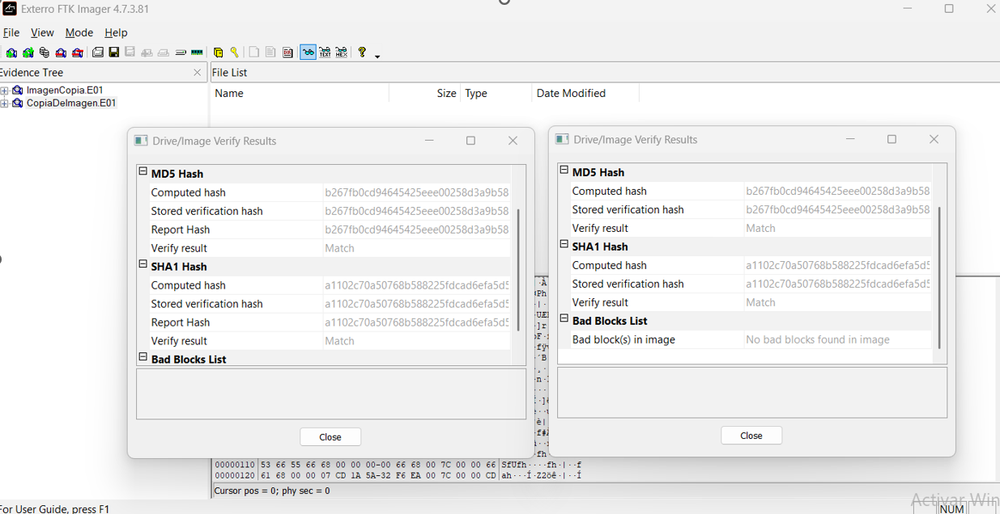
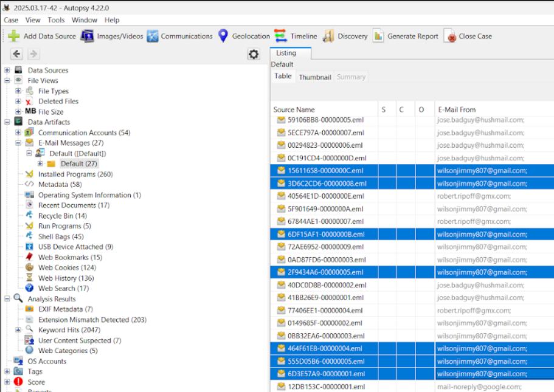

# Herramientas Forenses Digitales
Este repositorio documenta algunas herramientas esenciales en el análisis forense digital, útiles para la adquisición, preservación, análisis y verificación de evidencia.

# Herramientas
* [**FTK Imager:**](https://www.exterro.com/ftk-product-downloads/ftk-imager-4-7-3-81) Herramienta de adquisición forense por software que permite crear imágenes exactas de discos duros, dispositivos extraíbles o carpetas específicas.
Se utiliza para capturar evidencia digital sin alterar los datos originales, facilitando también una vista preliminar de los archivos y sistemas de archivos.

  

* [**Autopsy:**](https://www.autopsy.com/download/) Plataforma de análisis forense de código abierto basada en The Sleuth Kit.
Permite investigar discos, analizar sistemas de archivos, recuperar archivos eliminados, y extraer artefactos de interés como historiales de navegación, correos electrónicos y más.

  

* **USB Write Blocker:** Es un software que impide la escritura en dispositivos de almacenamiento USB.
Se utiliza para garantizar que los dispositivos de almacenamiento se examinen de manera segura, evitando cualquier alteración o daño a la evidencia original.

* **HashTab:** Software que integra el cálculo de hash (MD5, SHA-1, SHA-256, etc.) en las propiedades de archivos del sistema operativo.
Se usa para verificar la integridad de archivos, comparando los valores hash para asegurar que no han sido modificados.

* **HxD Setup:** Es un editor hexadecimal gratuito que permite visualizar y editar archivos binarios.
Se emplea para analizar, editar o reparar archivos a bajo nivel, muy útil para investigaciones forenses que requieren trabajar directamente sobre estructuras de datos.

* [**Eric Zimmerman's Tool:**](https://ericzimmerman.github.io/#!index.md) Es un conjunto de utilidades forenses gratuitas desarrolladas por Eric Zimmerman, enfocadas en el análisis de artefactos de Windows.
Estas herramientas permiten examinar registros, archivos de Prefetch, datos de navegación, registros de actividad de usuario y otros artefactos críticos en investigaciones forenses. Son altamente especializadas y optimizadas para el procesamiento eficiente de grandes volúmenes de evidencia.

> [!NOTE]
> Aunque las herramientas 'FTK IMAGER' y 'Autopsy' son Open Source, se requiere de crear una cuenta en sus respectivas paginas para su descarga.

> [!NOTE]
> Las herramientas dadas por Eric Zimmerman solo estan disponibles para sistemas operativos Windows.
